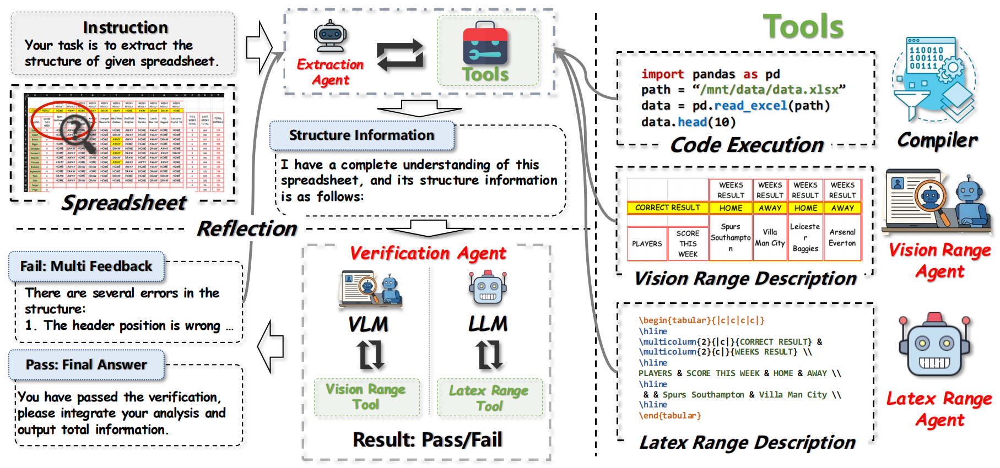

## Towards Robust Real-World Spreadsheet Understanding with Multi-Agent Multi-Format Reasoning

### Introduction

We present Spreadsheet Agent, a two-stage multi-agent framework for robust spreadsheet understanding. By incrementally reading local spreadsheet regions with multimodal signals and verifying extracted structures before reasoning, Spreadsheet Agent handles large real-world spreadsheets more effectively and surpasses the ChatGPT Agent on Spreadsheet Bench.



---

### Data

All data are packaged in `data.tar.xz`. You can decompress it directly in the root directory of the project.

```bash
tar -xvf data.tar.xz -C ./
```

---

### Pre Setup

#### Jupyter Server

All code is located in the `code_exec_docker` folder. You can start the Jupyter server as follows:

```bash
# Step 1: Download the docker image
docker pull docker.io/xingyaoww/codeact-executor

# Step 2: Start the Jupyter server
bash start_jupyter_server.sh
```

#### Excel to Image

The Excel-to-Image feature requires the win32com package, which is only available on Windows.

```bash
python core/excel2image.py
```

### Extract Structure Information

Both Qwen3-Coder-480B-A35B and GLM-4.5V need to be deployed with vLLM.

```bash
python extractor.py \
    --extractor yaml_desc_verify \
    --dataset spreadsheet \
    --url url_of_qwen3_coder \
    --vision_url url_of_glm_4.5v \
    --suffix 480b_glm45v
```

Then you can find the extracted structure information in `data/spreadsheet`. 

### Evaluation

After extraction, you can run the evaluation on SpreadsheetBench:

```bash
python spreadsheet.py --url url_of_qwen3_coder --suffix 480b_glm45v
```